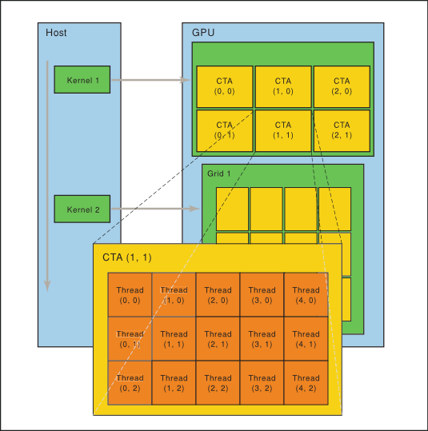

# GPU / NVPTX Parabix - Update 1

## Notes on the GPU

The GPU is very different from the CPU.
A GPU program needs to account for restrictions.
For example, each GPU thread has a local block of memory that cannot be accessed from other threads.
Also, some threads will always execute the same instruction at the same time.
Here are some details.

* Thread Hierarchy
  * The GPU is divided into grids
    * Each has a unique grid id (gridid)
    * Each grid is independent
  * Grids are divided into CTAs / cooperative thread arrays (This is in PTX. These are called blocks in CUDA)
    * Each has a unique block id (ctaid)
    * Threads in a block / CTA can synchronize at barriers, and share memory
  * CTAs are divided into warps
    * all threads in the same warp execute the same instruction at the same time
    * Usually 32 threads
    * icgrep uses warps of 64 threads
  * Warps are divided into threads
    * Each thread in a block has a unique thread id (tid)




* Memory Hierarchy: Address spaces
  * Address space 1 is the "global" address space, which is accessable to all threads in all blocks in all grids on the GPU
  * Address space 3 is the "shared" address space, which is accessable to all threads in one block on the GPU
  * Address space 4 is the "constant" address space, which is accessable to all threads on the GPU, read-only
  * Address space 5 is the "local" address space, which is accessable to one thread on the GPU
  * Address space 0 is the "generic" address space, which includes all other address spaces.
    * An address in another space can be converted to a generic address by adding the base address for the smaller address's window.


## Summary of GPU Problems

* GPU support has been broken from revision 5706 onwards.
  * Change 5706 implements major restructuring, affecting thousands of lines of code
  * The GPU / NVPTX pipeline was not updated
  * The problem seems to be that a kernel on the GPU is trying to access the stack memory on the CPU
    * Note, Alloc creates stack memory, Malloc creates heap memory
  * Naive fix attempts don't work (disabling the error check leads to corrupt IR)
  * Address spaces are different
  * Change 5597 adds Malloc for streamset buffers in address space 0, but GPU buffers are created in address space 1
  * Editd creates these GPU buffers:
    * StreamSetBuffer * CCStream = pxDriver.addBuffer(make_unique<SourceBuffer>(iBuilder, iBuilder->getStreamSetTy(4), 1));
    * ExternalBuffer * ResultStream = pxDriver.addExternalBuffer(make_unique<ExternalBuffer>(iBuilder, iBuilder->getStreamSetTy(editDistance+1), resultStreamPtr, 1));
  * GrepEngine creates this GPU buffers:
    * StreamSetBuffer * ByteStream = mGrepDriver->addBuffer(make_unique<SourceBuffer>(idb, idb->getStreamSetTy(1, 8), 1));

## Updating to work with 5597

* We need to create Mallocs for non-generic address spaces, replacing the Alloc, here:
``` {c++}
void StreamSetBuffer::allocateBuffer(const std::unique_ptr<kernel::KernelBuilder> & iBuilder) {
    if (LLVM_LIKELY(mStreamSetBufferPtr == nullptr)) {
        Type * const ty = getType();
        if (mAddressSpace == 0) {
            Constant * size = ConstantExpr::getSizeOf(ty);
            size = ConstantExpr::getMul(size, ConstantInt::get(size->getType(), mBufferBlocks));
            mStreamSetBufferPtr = iBuilder->CreatePointerCast(iBuilder->CreateCacheAlignedMalloc(size), ty->getPointerTo());
        } else {
            mStreamSetBufferPtr = iBuilder->CreateCacheAlignedAlloca(ty, iBuilder->getSize(mBufferBlocks));
        }
        iBuilder->CreateAlignedStore(Constant::getNullValue(ty), mStreamSetBufferPtr, iBuilder->getCacheAlignment());
    } else {
        report_fatal_error("StreamSetBuffer::allocateBuffer() was called twice on the same stream set");
    }
}
```

## Heap Allocations for Stream Set Buffers on the GPU

Revision 5597 introduces heap allocation for stream set buffers; attempting to use icgrep with `-NVPTX` set would result in a `LLVM ERROR: stdlib.h does not contain either aligned_alloc or posix_memalign` error, which would indicate that the builder is attempting to call one of the allocation functions from the NVPTXDriver when `CreateCacheAlignedMalloc` is called. 

The new stream set buffer allocation method is defined in revision 5597 like so:
```
void StreamSetBuffer::allocateBuffer(const std::unique_ptr<kernel::KernelBuilder> & iBuilder) {
    if (LLVM_LIKELY(mStreamSetBufferPtr == nullptr)) {
        Type * const ty = getType();
        if (mAddressSpace == 0) {
            Constant * size = ConstantExpr::getSizeOf(ty);
            size = ConstantExpr::getMul(size, ConstantInt::get(size->getType(), mBufferBlocks));
            mStreamSetBufferPtr = iBuilder->CreatePointerCast(iBuilder->CreateCacheAlignedMalloc(size), ty->getPointerTo());
        } else {
            mStreamSetBufferPtr = iBuilder->CreateCacheAlignedAlloca(ty, iBuilder->getSize(mBufferBlocks));
        }
        iBuilder->CreateAlignedStore(Constant::getNullValue(ty), mStreamSetBufferPtr, iBuilder->getCacheAlignment());
    } else {
        report_fatal_error("StreamSetBuffer::allocateBuffer() was called twice on the same stream set");
    }
}
 ```
The problem was that icgrep was constructing buffers in the default address space, where aligned allocs were the default. The function for aligned alloc functions did not exist on the gpu device (posix_memalign or alligned_alloc). Parameterizing `grepPipeline` to take an address space (defaulting to 0 for the CPU) fixes the error but leaves the stream set buffer allocated on the stack rather than the heap. 


``` {diff}
Index: grep_engine.cpp
===================================================================
--- grep_engine.cpp	(revision 5597)
+++ grep_engine.cpp	(working copy)
@@ -304,7 +304,7 @@
 }
 
     
-std::pair<StreamSetBuffer *, StreamSetBuffer *> grepPipeline(Driver * grepDriver, std::vector<re::RE *> REs, const GrepModeType grepMode, unsigned encodingBits, StreamSetBuffer * ByteStream) {
+std::pair<StreamSetBuffer *, StreamSetBuffer *> grepPipeline(Driver * grepDriver, std::vector<re::RE *> REs, const GrepModeType grepMode, unsigned encodingBits, StreamSetBuffer * ByteStream, unsigned AddressSpace = 0) {
     auto & idb = grepDriver->getBuilder();
     const unsigned segmentSize = codegen::SegmentSize;
     const unsigned bufferSegments = codegen::BufferSegments * codegen::ThreadNum;
@@ -311,16 +311,16 @@
     size_t MatchLimit = ((grepMode == QuietMode) | (grepMode == FilesWithMatch) | (grepMode == FilesWithoutMatch)) ? 1 : MaxCountFlag;
     
 
-    StreamSetBuffer * BasisBits = grepDriver->addBuffer(make_unique<CircularBuffer>(idb, idb->getStreamSetTy(encodingBits, 1), segmentSize * bufferSegments));
+    StreamSetBuffer * BasisBits = grepDriver->addBuffer(make_unique<CircularBuffer>(idb, idb->getStreamSetTy(encodingBits, 1), segmentSize * bufferSegments, AddressSpace));
     kernel::Kernel * s2pk = grepDriver->addKernelInstance(make_unique<kernel::S2PKernel>(idb));
     grepDriver->makeKernelCall(s2pk, {ByteStream}, {BasisBits});
     
-    StreamSetBuffer * LineBreakStream = grepDriver->addBuffer(make_unique<CircularBuffer>(idb, idb->getStreamSetTy(1, 1), segmentSize * bufferSegments));
+    StreamSetBuffer * LineBreakStream = grepDriver->addBuffer(make_unique<CircularBuffer>(idb, idb->getStreamSetTy(1, 1), segmentSize * bufferSegments, AddressSpace));
     kernel::Kernel * linebreakK = grepDriver->addKernelInstance(make_unique<kernel::LineBreakKernelBuilder>(idb, encodingBits));
     grepDriver->makeKernelCall(linebreakK, {BasisBits}, {LineBreakStream});
     
     kernel::Kernel * requiredStreamsK = grepDriver->addKernelInstance(make_unique<kernel::RequiredStreams_UTF8>(idb));
-    StreamSetBuffer * RequiredStreams = grepDriver->addBuffer(make_unique<CircularBuffer>(idb, idb->getStreamSetTy(4, 1), segmentSize * bufferSegments));
+    StreamSetBuffer * RequiredStreams = grepDriver->addBuffer(make_unique<CircularBuffer>(idb, idb->getStreamSetTy(4, 1), segmentSize * bufferSegments, AddressSpace));
     grepDriver->makeKernelCall(requiredStreamsK, {BasisBits}, {RequiredStreams});
     
     const auto n = REs.size();
@@ -343,11 +343,11 @@
     std::vector<StreamSetBuffer *> MatchResultsBufs(n);
 
     for(unsigned i = 0; i < n; ++i){
-        StreamSetBuffer * CharClasses = grepDriver->addBuffer(make_unique<CircularBuffer>(idb, idb->getStreamSetTy(charclasses[i].size()), segmentSize * bufferSegments));
+        StreamSetBuffer * CharClasses = grepDriver->addBuffer(make_unique<CircularBuffer>(idb, idb->getStreamSetTy(charclasses[i].size()), segmentSize * bufferSegments, AddressSpace));
         kernel::Kernel * ccK = grepDriver->addKernelInstance(make_unique<kernel::CharClassesKernel>(idb, charclasses[i]));
         ccK->setName("cc" + std::to_string(i));
         grepDriver->makeKernelCall(ccK, {BasisBits}, {CharClasses});
-        StreamSetBuffer * MatchResults = grepDriver->addBuffer(make_unique<CircularBuffer>(idb, idb->getStreamSetTy(1, 1), segmentSize * bufferSegments));
+        StreamSetBuffer * MatchResults = grepDriver->addBuffer(make_unique<CircularBuffer>(idb, idb->getStreamSetTy(1, 1), segmentSize * bufferSegments, AddressSpace));
         kernel::Kernel * icgrepK = grepDriver->addKernelInstance(make_unique<kernel::ICGrepKernel>(idb, REs[i], true, charclasses[i].size()));
         grepDriver->makeKernelCall(icgrepK, {CharClasses, LineBreakStream, RequiredStreams}, {MatchResults});
         MatchResultsBufs[i] = MatchResults;
@@ -354,7 +354,7 @@
     }
     StreamSetBuffer * MergedResults = MatchResultsBufs[0];
     if (REs.size() > 1) {
-        MergedResults = grepDriver->addBuffer(make_unique<CircularBuffer>(idb, idb->getStreamSetTy(1, 1), segmentSize * bufferSegments));
+        MergedResults = grepDriver->addBuffer(make_unique<CircularBuffer>(idb, idb->getStreamSetTy(1, 1), segmentSize * bufferSegments, AddressSpace));
         kernel::Kernel * streamsMergeK = grepDriver->addKernelInstance(make_unique<kernel::StreamsMerge>(idb, 1, REs.size()));
         grepDriver->makeKernelCall(streamsMergeK, MatchResultsBufs, {MergedResults});
     }
@@ -363,7 +363,7 @@
     if (matchesNeedToBeMovedToEOL()) {
         StreamSetBuffer * OriginalMatches = Matches;
         kernel::Kernel * matchedLinesK = grepDriver->addKernelInstance(make_unique<kernel::MatchedLinesKernel>(idb));
-        Matches = grepDriver->addBuffer(make_unique<CircularBuffer>(idb, idb->getStreamSetTy(1, 1), segmentSize * bufferSegments));
+        Matches = grepDriver->addBuffer(make_unique<CircularBuffer>(idb, idb->getStreamSetTy(1, 1), segmentSize * bufferSegments, AddressSpace));
         grepDriver->makeKernelCall(matchedLinesK, {OriginalMatches, LineBreakStream}, {Matches});
     }
     
@@ -370,7 +370,7 @@
     if (InvertMatchFlag) {
         kernel::Kernel * invertK = grepDriver->addKernelInstance(make_unique<kernel::InvertMatchesKernel>(idb));
         StreamSetBuffer * OriginalMatches = Matches;
-        Matches = grepDriver->addBuffer(make_unique<CircularBuffer>(idb, idb->getStreamSetTy(1, 1), segmentSize * bufferSegments));
+        Matches = grepDriver->addBuffer(make_unique<CircularBuffer>(idb, idb->getStreamSetTy(1, 1), segmentSize * bufferSegments, AddressSpace));
         grepDriver->makeKernelCall(invertK, {OriginalMatches, LineBreakStream}, {Matches});
     }
     if (MatchLimit > 0) {
@@ -377,7 +377,7 @@
         kernel::Kernel * untilK = grepDriver->addKernelInstance(make_unique<kernel::UntilNkernel>(idb));
         untilK->setInitialArguments({idb->getSize(MatchLimit)});
         StreamSetBuffer * AllMatches = Matches;
-        Matches = grepDriver->addBuffer(make_unique<CircularBuffer>(idb, idb->getStreamSetTy(1, 1), segmentSize * bufferSegments));
+        Matches = grepDriver->addBuffer(make_unique<CircularBuffer>(idb, idb->getStreamSetTy(1, 1), segmentSize * bufferSegments, AddressSpace));
         grepDriver->makeKernelCall(untilK, {AllMatches}, {Matches});
     }
     return std::pair<StreamSetBuffer *, StreamSetBuffer *>(LineBreakStream, Matches);
@@ -429,12 +429,12 @@
     Value * inputStream = idb->CreateGEP(inputStreamPtr, tid);
     Value * bufferSize = idb->CreateLoad(idb->CreateGEP(bufferSizesPtr, bid));
 
-    StreamSetBuffer * ByteStream = mGrepDriver->addBuffer(make_unique<SourceBuffer>(idb, idb->getStreamSetTy(1, 8), 1));
+    StreamSetBuffer * ByteStream = mGrepDriver->addBuffer(make_unique<SourceBuffer>(idb, idb->getStreamSetTy(1, 8), 1, 1));
     kernel::Kernel * sourceK = mGrepDriver->addKernelInstance(make_unique<kernel::MemorySourceKernel>(idb, inputStreamType, segmentSize));
     sourceK->setInitialArguments({inputStream, bufferSize});
     mGrepDriver->makeKernelCall(sourceK, {}, {ByteStream});
 
-    StreamSetBuffer * Matches = std::get<1>(grepPipeline(mGrepDriver, REs, grepMode, encodingBits, ByteStream));
+    StreamSetBuffer * Matches = std::get<1>(grepPipeline(mGrepDriver, REs, grepMode, encodingBits, ByteStream, 1));
     
     kernel::Kernel * matchCountK = mGrepDriver->addKernelInstance(make_unique<kernel::PopcountKernel>(idb));
     mGrepDriver->makeKernelCall(matchCountK, {Matches}, {});
Index: kernels/streamset.cpp
===================================================================
--- kernels/streamset.cpp	(revision 5597)
+++ kernels/streamset.cpp	(working copy)
@@ -33,6 +33,10 @@
             Constant * size = ConstantExpr::getSizeOf(ty);
             size = ConstantExpr::getMul(size, ConstantInt::get(size->getType(), mBufferBlocks));
             mStreamSetBufferPtr = iBuilder->CreatePointerCast(iBuilder->CreateCacheAlignedMalloc(size), ty->getPointerTo());
+        } else if (mAddressSpace == 1) {
+            Constant * size = ConstantExpr::getSizeOf(ty);
+            size = ConstantExpr::getMul(size, ConstantInt::get(size->getType(), mBufferBlocks));
+            mStreamSetBufferPtr = iBuilder->CreatePointerCast(iBuilder->CreateMalloc(size), ty->getPointerTo());
         } else {
             mStreamSetBufferPtr = iBuilder->CreateCacheAlignedAlloca(ty, iBuilder->getSize(mBufferBlocks));
         }
@@ -43,7 +47,7 @@
 }
 
 void StreamSetBuffer::releaseBuffer(const std::unique_ptr<kernel::KernelBuilder> & iBuilder) const {
-    if (mAddressSpace == 0) {
+    if (mAddressSpace == 0 || mAddressSpace == 1) {
         iBuilder->CreateFree(mStreamSetBufferPtr);
     }
 }
@@ -270,7 +274,7 @@
         mStreamSetBufferPtr = iBuilder->CreateCacheAlignedAlloca(ty, iBuilder->getSize(mBufferBlocks));
         iBuilder->CreateAlignedStore(Constant::getNullValue(ty), mStreamSetBufferPtr, iBuilder->getCacheAlignment());
     } else {
-        report_fatal_error("StreamSetBuffer::allocateBuffer() was called twice on the same stream set");
+        report_fatal_error("SourceBuffer::allocateBuffer() was called twice on the same stream set");
     }
 }
 
@@ -557,6 +561,12 @@
     report_fatal_error("Expandable buffers: getLinearlyAccessibleItems is not supported.");
 }
```

## Performance impact

Command: `time /tmp/icgrep -NVPTX -f patterns random`

Files:

* `patterns` contains 100 6-character patterns

* `random` contains 1.0 GB of 63-character lines, 87 of which are in `patterns`

| CPU icgrep | GPU icgrep Malloc | GPU icgrep Alloc | grep |
| -----------|-------------------|------------------|------|
| 18 s | 12 s | 10 s | 4s |
