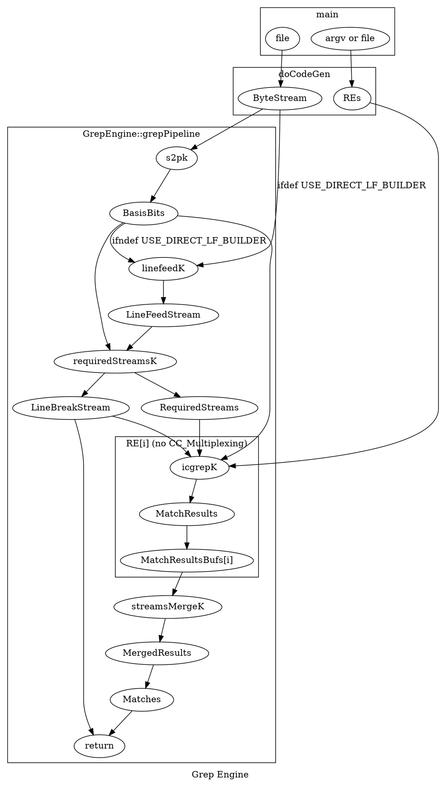

# Grep Pipeline

Here's a graph of the icgrep pipeline

```dot
digraph G {
label = "Grep Engine"


subgraph clusterMain {
label = "main"
"argv or file"
"file"
}
"argv or file" -> "REs"
"file" -> "ByteStream"

subgraph clusterCodeGen {
label = "doCodeGen"
"REs"
"ByteStream"
}

subgraph clusterG {
label = "GrepEngine::grepPipeline"
"LineFeedStream"
"linefeedK"

"ByteStream" -> "linefeedK" [ label = "ifdef USE_DIRECT_LF_BUILDER" ]
"linefeedK" -> "LineFeedStream"

"BasisBits"
"s2pk"
"ByteStream" -> "s2pk"
"s2pk" -> "BasisBits"

"BasisBits" -> "linefeedK" [ label = "ifndef USE_DIRECT_LF_BUILDER" ]

"LineBreakStream"
"requiredStreamsK"
"RequiredStreams"
"BasisBits" -> "requiredStreamsK"
"LineFeedStream" -> "requiredStreamsK"
"requiredStreamsK" -> "RequiredStreams"
"requiredStreamsK" -> "LineBreakStream"

subgraph clusterR {
label = "RE[i] (no CC_Multiplexing)"
"MatchResults"
"icgrepK"
"MatchResultsBufs[i]"
}

"REs" -> "icgrepK"
"BasisBits" ->"icgrepK"
"LineBreakStream" -> "icgrepK"
"RequiredStreams" -> "icgrepK"
"icgrepK" -> "MatchResults"
"MatchResults" -> "MatchResultsBufs[i]"

"MergedResults"
"streamsMergeK"
"MatchResultsBufs[i]" -> "streamsMergeK"
"streamsMergeK" -> "MergedResults"

"MergedResults" -> "Matches"

"LineBreakStream" -> "return"
"Matches" -> "return"

}

}
```
