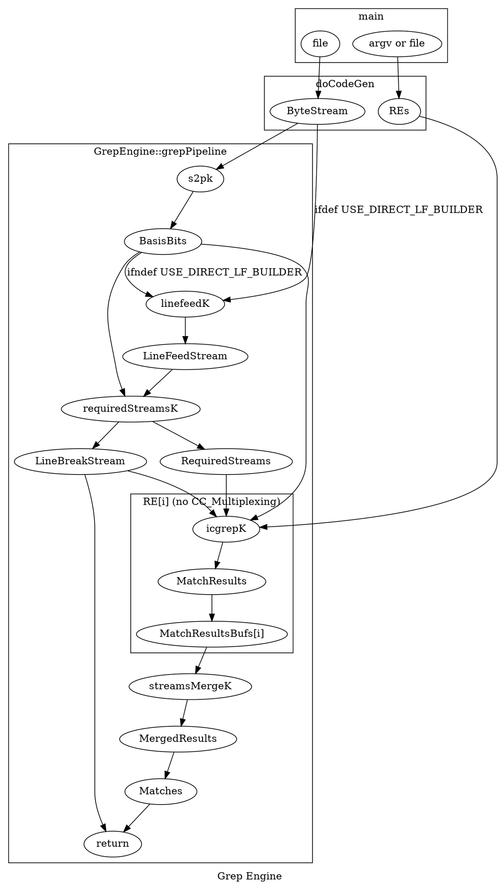

# Grep Pipeline

Here's a graph of the icgrep pipeline




### Bootstrap process, which hooks up icgrep with the driver which uses the NVPTX Builder:

1. main (if codegen::NVPTX)
2. GrepEngine::grepCodeGen_nvptx
3. NVPTXDriver::NVPTXDriver
4. GetIDISA_GPU_Builder
5. KernelBuilderImpl<IDISA_NVPTX20_Builder>

## Codegen process, with example for generating a long add

1. NVPTXDriver::finalizeObject (loop for kernel in pipeline)
2. Kernel::generateX
3. PabloKernel::generateDoBlockMethod
4. PabloCompiler::compile
4. PabloCompiler::compileX (X is each element, recursively)
5. PabloCompiler::compileStatement (e.g. if stmt is matchStar)
6. CarryManager::addCarryInCarryOut
7. IDISA_NVPTX20_Builder::bitblock_add_with_carry
8. IDISA_NVPTX20_Builder::mLongAddFunc
9. \<llvm function\>

## Compilation of RE

1. ParabixDriver::makeKernelCall (icgrepK)
1. Kernel::makeModule
1. PabloKernel::prepareKernel
2. pure virtual generatePabloMethod
3. ICGrepKernel::generatePabloMethod
4. re2pablo_compiler
5. RE_Compiler::compile
6. RE_Compiler::process
7. RE_Compiler::compileX (X is each element, recursively)
8. RE_Compiler::compileRep
9. RE_Compiler::processUnboundedRep (note: other parts of rep are also processed)
10. PabloBuilder::createX (X is each thing to create)

# Editd

## Codegen

1. editd/editd.cpp:main
1. editd/editd.cpp:editdGPUCodeGen

## Kernel Launch

1. editd/editd.cpp:main
1. editd/EditdCudaDriver.h:RunPTX (immediately after codegen)
1. cuLaunchKernel(function, ... (after loading functions from module from `.ptx` file)
1. cuLaunchKernel(merge, ...


## Problem trace

```
LLVM ERROR: SourceBuffer: base address was declared with address space 0 but given a pointer in address space 1
./icgrep-build-cuda-5891/editd(_ZNK7parabix12 SourceBuffer 14 setBaseAddress EPN5IDISA13IDISA_BuilderEPN4llvm5ValueES6_+0x2aa) [0x6323fa]
./icgrep-build-cuda-5891/editd(_ZN6kernel18 MemorySourceKernel 24 generateInitializeMethod ERKSt10unique_ptrINS_13KernelBuilderESt14default_deleteIS2_EE+0x8e) [0x63f3de]
./icgrep-build-cuda-5891/editd(_ZN6kernel6 Kernel 14 generateKernel ERKSt10unique_ptrINS_13 KernelBuilder ESt14default_deleteIS2_EE+0x928) [0x61c028]
./icgrep-build-cuda-5891/editd(_ZN11NVPTXDriver14 finalizeObject Ev+0x161) [0x610ba1]
./icgrep-build-cuda-5891/editd(_Z15 editdGPUCodeGen j+0xa3f) [0x599edf]
./icgrep-build-cuda-5891/editd( main +0x450) [0x575110]
```
