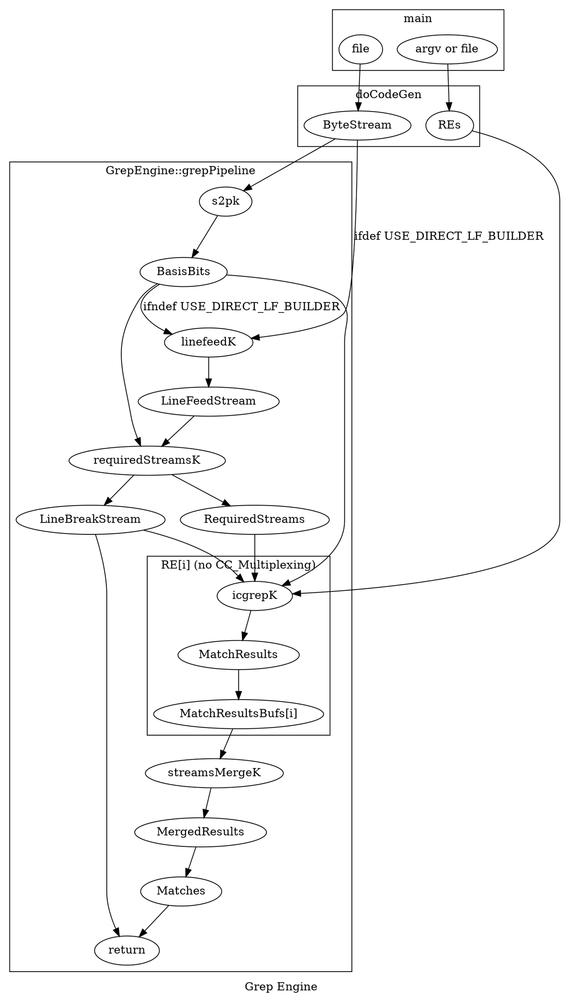

# Grep Pipeline

Here's a graph of the icgrep pipeline

### Bootstrap process, which hooks up icgrep with the driver which uses the NVPTX Builder:

1. main (if codegen::NVPTX)
2. GrepEngine::grepCodeGen_nvptx
3. NVPTXDriver::NVPTXDriver
4. GetIDISA_GPU_Builder
5. KernelBuilderImpl<IDISA_NVPTX20_Builder>

## Codegen process, with example for generating a long add

1. NVPTXDriver::finalizeObject (loop for kernel in pipeline)
2. Kernel::generateX
3. PabloKernel::generateDoBlockMethod
4. PabloCompiler::compile
4. PabloCompiler::compileX (X is each element, recursively)
5. PabloCompiler::compileStatement (e.g. if stmt is matchStar)
6. CarryManager::addCarryInCarryOut
7. IDISA_NVPTX20_Builder::bitblock_add_with_carry
8. IDISA_NVPTX20_Builder::mLongAddFunc
9. \<llvm function\>

## Compilation of RE

1. ParabixDriver::makeKernelCall (icgrepK)
1. Kernel::makeModule
1. PabloKernel::prepareKernel
2. pure virtual generatePabloMethod
3. ICGrepKernel::generatePabloMethod
4. re2pablo_compiler
5. RE_Compiler::compile
6. RE_Compiler::process
7. RE_Compiler::compileX (X is each element, recursively)
8. RE_Compiler::compileRep
9. RE_Compiler::processUnboundedRep (note: other parts of rep are also processed)
10. PabloBuilder::createX (X is each thing to create)
